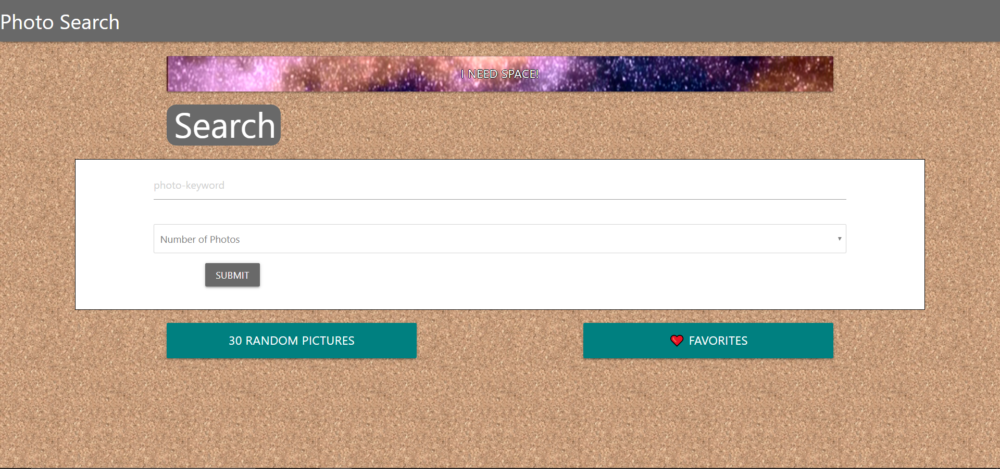
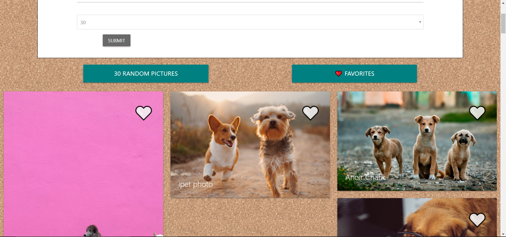
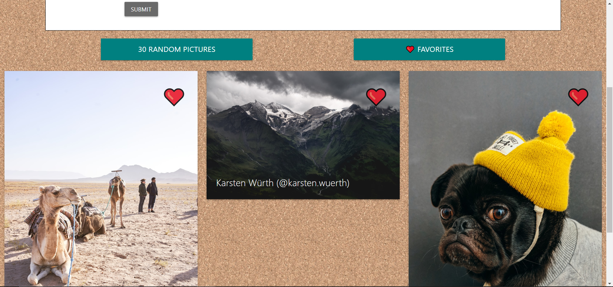
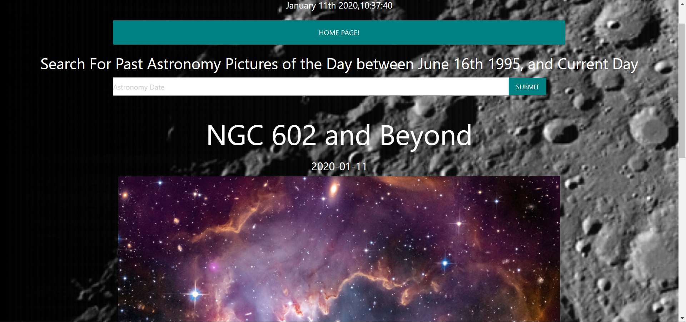

# Project Title
​ Photography Inspiation of the Day
## Overview
​
The purpose of this application is to give you an alternative to something like Google images. This site is super clean and gives 
you a limited number of search parameters so that you have a simple site that does almost the same as something that is kind of 
like it. The API is a Unsplash API so all of the pictures that you see are high resolution photos that real people in the world
have taken. If you really like a picture that you see, you can also save it to your favorites for later! You also will see a 
button on the top that when you press it will show you the astronomy picture of the day (compliments of NASA), or you can look up a different 
day to see the astronomy picture for that day. 
​ 
### Gallery
​
Home:

​
Search for Something:

​
Favorites:

​
NASA APOD Page:

### Problem
​
Currently ...
(User Story Problem)
When amateur photographers go online to search for inspiration, many utilize Gooogle Images or other search engines for ideas. However, search engines are notorious for providing as many results as possible, and they range dramatically in the quality of the results they provide. 

(Technical Challenges)
​Currently there are no issues with it but we had a lot of issues on the way like local storage and getting the pictures to append 
correctly to the favs DOM, getting everything to be responsive...

### Solution
(User Story Solution)
This photo search app provides a smaller number of search results so the user does not feel overwhelmed with choice paralysis. Additionally, because this app leverages the Unsplash API, all of the photos it returns are very high quality. 
The solutions made it an all-around better website that worked better and was more dynamic and had more depth so that people are 
inclined to actually use our site, and it also gave us a whole other group of people that would be able to use our website because
we made it look so good on mobile. 

(Technical Solutions)
​The solution to these was just research and finding a way to give each picture a data index when you save it so that way you can 
just append that same data to the favorites DOM. We also jsut had to use the grid system that Materialize gives up to make it 
sure resposive and look good on mobile as well. 

​ 
## Tech and Features Used
​
* Materialize
* Javascript
* JQuery
* Unsplash API
* NASA APOD API
* HTML
* CSS
* Moment.JS
​
## How to use
​
When the page first loads up you will see a page with a few buttons and a search box. On that search box you will see two different
search parameters, the photo keyword, and the amount of photos you would like to see. You can search for something like "dogs" and
show you 30 photos because who doesn't want to see the most amount of photos of dogs? Then, under the search bar you will see
dynamically created photos with a heart button and the name/username of the person that took the photo from Unsplash. 

Under the search bar you will also see a button that says 30 random photos. When you click on this, it will go to Unsplash and get 30 random
photos and display them under the search bar. 

If you really like any of the photos that you see you can press the little whiteheart and it will turn red. The reason that it turns red is because it saves that photo to your favorites tab. When you click on the favorites button in will replace any of the already showing photos with any of the photos that you have ever saved on your computer. 

After you are done with the searching of photos you can press on the "I Need Space!" button and it will take you to a different page. 
On this page you will see what time and day it is, and a search bar. You will also see the title, time, description, and the astronomy picture 
of the day. This is all information the NASA posts everyday to give people like us cool pictures of space and space-related things. 
When you click on the search bar it will make a  calendar picker pop-up and have you choose a date between June 16th 1995 (NASA's first publicly-available photo) and the current day. When you click search the original picture of the day and its info will change that the picture of the day and info for the day that you looked up. 

You can then click the home button and go back to the home page and keep searching for and favoriting photos!
​
## Technical Overview
​
1. When you search for something, it calls to the Unsplash API and gets the info that you get. 
2. The Javascript then takes that info and turns in into a dynamic card so you can see the photos you searched for. 
3. When you click on the little heart, it changes the emoji to a red heart emoji and saves all the data the Unsplash gave us to the 
   local storage so that we can use it for the favorites page. 
4. When you click on the favorites button it clears the searched photos and shows you all the photos that you liked so you can get to them later. 
5. When you click on the "I Need Space!" button it take you to a whole different HTML page with a different Javascript file. 
6. This page calls to the NASA APOD API and shows the Astronomy Picture of the Day with the title, date, and explanation. 
7. You will see a search bar that you can use to see pictures for different days. 
8. When you search, it sends another ajax call that will change the info on the page and show the pictures and info for the day you searched for. 
9. Then when you click on the go home page it take you back to the first HTML file and saves all your favorites still. 
